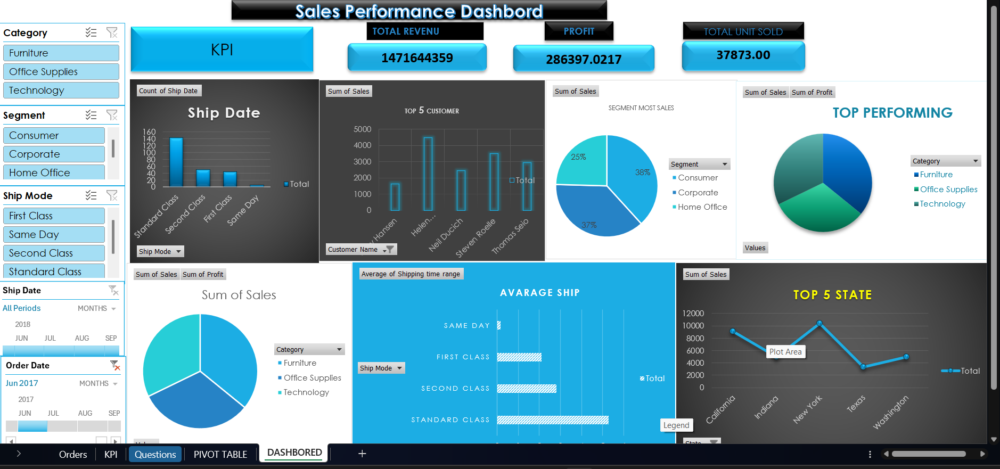

Sales Performance Dashboard - GitHub README
Project Overview
This project presents an interactive Sales Performance Dashboard created using Excel/BI visualization techniques. The dashboard provides detailed insights into sales, profit, shipping performance, customer analysis, segment performance, and regional sales trends.
Dashboard Features
•	Interactive slicers for Category, Segment, Ship Mode, Ship Date, and Order Date

•	KPI Cards displaying Total Revenue, Profit, and Units Sold

•	Top 5 Customer sales analysis

•	Segment-wise sales distribution

•	Category performance comparison

•	Average shipping time analysis

•	Top 5 State sales performance

•	Dynamic charts and visual insights

Tools & Technologies

•	Microsoft Excel

•	Pivot Tables

•	Charts & Graphs

•	Dashboard Design

•	Data Cleaning & Analysis

Dashboard Preview
 
Key Insights
•	Technology and Furniture categories contribute significantly to total sales.

•	Standard Class shipping mode is used most frequently.

•	New York and California are top-performing states.

•	Consumer segment generates the highest sales contribution.

•	Top customers contribute major revenue share.

Dashboard Screenshot

GitHub README Description
Designed and developed an interactive Sales Performance Dashboard to analyze revenue, profit, customer performance, shipping trends, and regional sales insights. The dashboard includes KPI cards, dynamic slicers, pivot charts, and visual analytics to support data-driven decision-making.

Created for GitHub Portfolio Showcase
